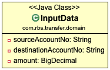
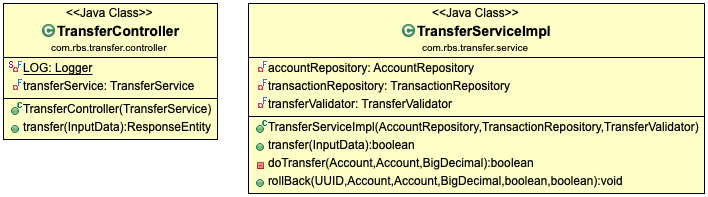
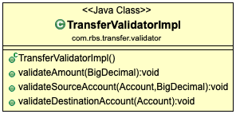
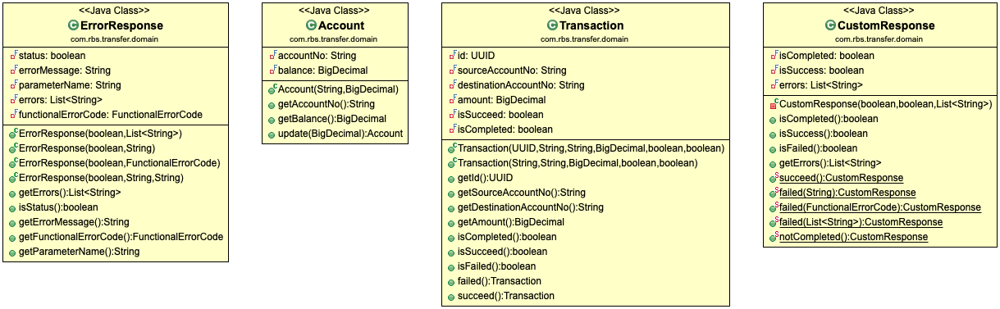
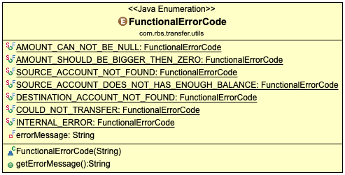
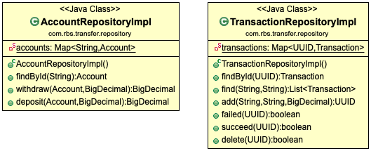
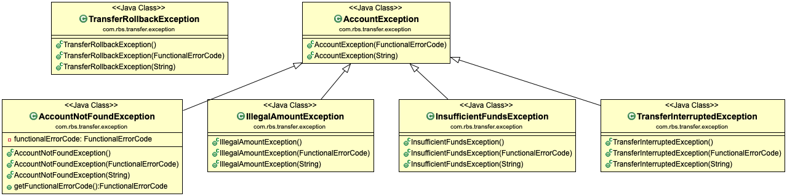
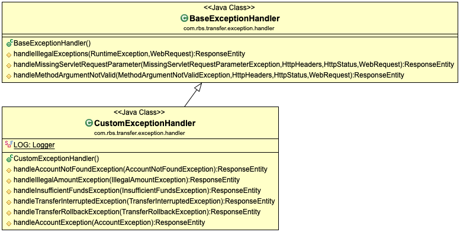

# Transfer Service
The microservice aims to transfer funds between internal accounts.

Please make sure you've installed gradle and use the commands below to build microservice.

```
$ ./gradlew clean build
```
##



## Input Validation
There are three mandatory parameters which needs to be passed through the service.

| Fields                | Data Type   | E.g.       |
| --------------------- |:-----------:| ----------:|
| sourceAccountNo       | String      | 78391876   |
| destinationAccountNo  | String      | 98361426   |
| amount                | BigDecimal  | 1000.10    |

Sample payload for corresponding input diagram is below, Http POST method is required to make the API call.


```
http://localhost:8080/v1/transfer
```
```
{
      "sourceAccountNo": "8785412439",
      "destinationAccountNo": "1794531147",
      "amount":"81.11248"
}
```
We also prefer to use the following headers listed below before you pass the payload.

```
| Header Key   | Header Value     |           |
| -------------|:----------------:| :--------:|
| Accept       | application/json | Optional  |
| Content-Type | application/json | Required  |
```

## Controller and Service Layer

As soon as input parameters validated, they are going to be passed through the service layer.



There are several validation checks provided by service class which validate source and destination accounts, it also checks available funds in source account.


## Input, Account and Available Funds Validator



Validator is responsible for followings,
- Checks transferable amount requested.
- Checks sufficient and insufficient funds in source account.
- Checks whether source account exists or not.
- Checks whether destination account exists or not.

## Account and Transaction Domains / Response DTOs


- Account class is responsible to hold account information
- Transfer class is responsible to hold transfer information and it also has `failed` and `succeed` state to mark transaction as completed.

## Business Error Codes

Error Codes holds the current state of transaction which will be informed to representation layer.



| Error Code                                   | Description                                  |
| -------------------------------------------- |:--------------------------------------------:|
| AMOUNT_CAN_NOT_BE_NULL                       | Amount can not be null                       |
| AMOUNT_SHOULD_BE_BIGGER_THEN_ZERO            | Amount should be bigger than zero.           |
| SOURCE_ACCOUNT_NOT_FOUND                     | Source account not found.                    |
| SOURCE_ACCOUNT_DOES_NOT_HAS_ENOUGH_BALANCE   | Source account does not has enough balance.  |
| DESTINATION_ACCOUNT_NOT_FOUND                | Destination account not found.               |
| COULD_NOT_TRANSFER                           | Could not transfer.                          |
| INTERNAL_ERROR                               | Internal Error.                              |

## Account and Transaction Repositories

Both repositories are responsible to save the accounts and transactions in memory.



- Account repository also responsible with withdraw and deposit progress
- Transaction repository has additional `failed` and `succeed` methods to mark transactions as completed.

## Business Exceptions

Each exception has its own responsibility.

| Exception Name                | Description                                                        |
| ----------------------------- |:------------------------------------------------------------------:|
| AccountException              | Base exception which been extended by many of below.               |
| AccountNotFoundException      | Thrown when account does not exists.                               |
| IllegalAmountException        | Thrown when amount information passed is invalid.                  |
| InsufficientFundsException    | Thrown when funds not available in source account.                 |
| TransferInterruptedException  | Thrown when transfer failed. There could be multiple reasons.      |
| TransferRollbackException     | Thrown if rollback functionality failed after failed transaction.  |





## Exception Handlers

Custom Exception Handler extends the state of Base Exception Handler

- Base exception handler has responsibility of common exceptions across framework.
- Custom exception handler is responsible for business exception handling.


